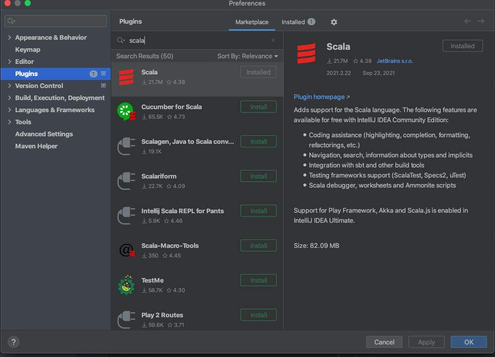

# Instructions


Make sure that the below setup is done so that its easy to work with the project.

## Docker Desktop

Install docker desktop from [here](https://www.docker.com/products/docker-desktop)

## Spring boot example project 

Clone from [here](https://github.com/spring-petclinic/spring-petclinic-rest)

## Maven Helper plugin (Not mandatory, but helps understanding maven dependencies)


## Scala plugin



## Update Project Settings

Refer [here](https://www.jetbrains.com/help/idea/project-structure-dialog.html) to learn how to open up the project settings dialog window.

From Project Structure dialog window, make sure that you choose Scala SDK `2.13.1`


## Steps

### Start InfluxDB and Grafana containers

InfluxDB and Grafana docker containers are needed to capture the streaming metrics that are triggered from the Gatling performance tests.

From the project directory run the below command to start both the InfluxDB and Grafana containers.

```
docker-compose -f DockerGrafanaInfluxKit/docker-compose.yml up -d --build
```

To bring down the started containers run the comand

```
docker-compose -f DockerGrafanaInfluxKit/docker-compose.yml down -v
```

### Start the sample spring boot application 

Run the command

```
./mvnw spring-boot:run
```

### Start the Gatling recorder

Open the project in IntelliJ IDE and run the Gatling recorder class `Recorder` by clicking on the Green Run button (See screenshot below)


The recorder would now be invoked and you should see a screen like below


Provide a desired name for your recording by filling up the field named `Class Name*` (The default name would always be `RecordedSimulation`. If you don't change this, the subsequent recordings will cause the file to be overwritten)

Now hit the `Start` button located at the bottom right corner of the screen 

The recorder should now be running and listening on port `8000`


### Setup Proxy information in Postman

For detailed instructions on how to do it please refer to [here](https://learning.postman.com/docs/sending-requests/capturing-request-data/proxy/)


**Note:** Use the port number of gatling recorder (`8000` in our case) as the proxy port value for postman.

### Start the Sample REST API application.

Clone the spring boot REST API application from [here](https://github.com/spring-petclinic/spring-petclinic-rest).

You can start the application by running `./mvnw spring-boot:run`.

Refer to the [Swagger UI](http://localhost:9966/petclinic/swagger-ui.html) page to view the list of REST APIs that are available with this sample application.

### Invoke REST API calls.

Now you can create your Gatling performance test via recording, by firing the desired API calls through postman. Once you are done remember to click `Stop & Save` button on the top right corner of the Gatling IDE.

### Recording Gatling performance test.

You should see the gatling test recorded and available in `src/test/scala` inside a sub-package. Refer [here](src/test/scala/com/rationaleemotions/RecordedSimulation.scala) for one such sample. 

**Note:**
By default the recording is always for 1 user, but the sample has been altered to run for 100 users.

### Running the gatling performance test

You can run the gatling performance test via the command 

```
mvn clean gatling:test
```

**Note:** Remember to run this command from the `gatling-sample` project's root folder.


### Grafana dashboard

Open up the grafana UI by loading the URL `http://localhost:3000/` and logging in using `admin/admin`.

Below is a sample Grafana dashboard


